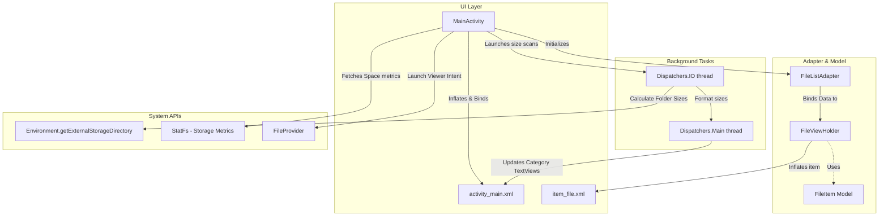

# FileSim

A lightweight, high-performance Android file manager that computes storage utilization by file type and supports standard file system operations. Built with Kotlin, Coroutines for asynchronous directory traversal, and Glide for visual assets.

## Core Features

*   **Storage Breakdown Dashboard**: Computes real-time storage metrics and groups files into six categories: Images, Documents, Music, Videos, Zipped/PDFs, and Unknown.
*   **Asynchronous Traversal**: Runs file size calculations and directory walks recursively on `Dispatchers.IO` threads to keep the main UI thread responsive.
*   **File Operations**: Supports single and batch actions: Copy, Paste, Move, Rename (with file-system state collision safety), and Delete (with confirmation).
*   **Multi-Select Mode**: Long-press lists to enter selection mode, supporting individual toggles and "Select All".
*   **Implicit Intent Launcher**: Leverages Android `FileProvider` and MIME-type detection to launch the system-default apps for images, audio, video, and text.
*   **Collapsible UI**: Toggleable dashboard card layout that can expand to show stats or collapse to maximize screen space for file lists.

---

## Architecture & Flow

The codebase divides responsibilities between presentation (`MainActivity`), list management (`FileListAdapter` + `ListAdapter` with `DiffUtil`), data representation (`FileItem`), and background threads (`kotlinx.coroutines`).



---

## Tech Stack & Specifications

*   **Min SDK**: 24 (Android Nougat)
*   **Target / Compile SDK**: 36
*   **Language**: Kotlin 2.0.21 (JVM target 11)
*   **Gradle**: 8.13.2 (with Kotlin DSL and central version catalog)
*   **Libraries**:
    *   `org.jetbrains.kotlinx:kotlinx-coroutines-android:1.6.0` (asynchronous directory walking)
    *   `com.github.bumptech.glide:glide:4.16.0` (dashboard asset loading)
    *   AndroidX ConstraintLayout, RecyclerView, Material Component libraries

---

## Directory Structure

```bash
FileSim/
├── app/
│   ├── build.gradle             # Target/compile configurations & dependencies
│   ├── proguard-rules.pro       # Code shrinking & R8 rules
│   └── src/
│       └── main/
│           ├── AndroidManifest.xml   # Storage permissions & FileProvider declarations
│           ├── java/com/example/filemanagerapp/
│           │   ├── MainActivity.kt       # Application lifecycle, system API calls, permissions
│           │   ├── FileListAdapter.kt    # ListAdapter with contextual select support
│           │   └── FileItem.kt           # Entity data model
│           └── res/
│               ├── layout/
│               │   ├── activity_main.xml # Dashboard & operations toolbar layout
│               │   └── item_file.xml     # RecyclerView item design
│               └── drawable/             # Graphical assets and layout backgrounds
├── gradle/
│   └── libs.versions.toml       # Centralized version catalog
├── settings.gradle              # Module inclusion (`:app`)
└── gradlew                      # Gradle Wrapper script
```

---

## Permissions & Storage Access

The application requires broad file system access.
*   `android.permission.MANAGE_EXTERNAL_STORAGE` is requested on devices running Android 11 (API Level 30) and above to perform operations outside the app's sandboxed storage.
*   `MainActivity` checks for this at startup and fires `ACTION_MANAGE_APP_ALL_FILES_ACCESS_PERMISSION` to prompt the system settings toggle if missing.

---

## Building and Running

### Command-Line Build
Compile and package the debug APK using the Gradle wrapper:

```bash
# Grant execution rights (macOS/Linux)
chmod +x gradlew

# Clean build and compile
./gradlew clean assembleDebug
```

The output APK will be generated at:
`app/build/outputs/apk/debug/app-debug.apk`

---

## License

This project is licensed under the MIT License.
