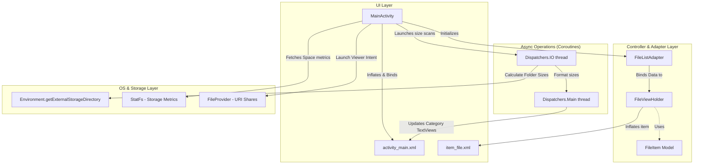

# 📂 FileSim — Android File Manager App

[](https://developer.android.com)
[](https://kotlinlang.org)
[](https://gradle.org)
[-orange?style=flat-square)](https://developer.android.com/about/versions/nougat)
[](LICENSE)

**FileSim** is a modern, lightweight, and high-performance Android File Manager designed to provide users with a clean, visual representation of their device's storage alongside advanced file manipulation tools. Built in **Kotlin** utilizing **Coroutines** for non-blocking I/O and **Glide** for smooth asset loading, the app prioritizes a fluid and responsive User Experience.

---

## 🚀 Key Features

*   📊 **Visual Storage Dashboard**: 
    *   Displays real-time available and total internal storage space.
    *   Animates storage consumption using a customized progress bar dynamically calculated on launch.
*   🗂️ **Smart Category Breakdown**: 
    *   Scans and groups storage contents into six color-coded classes: **Images**, **Documents**, **Music**, **Videos**, **Zipped/PDFs**, and **Unknown/Other**.
    *   Displays calculated size in GB for each category.
*   ⚡ **Asynchronous Directory Scanning**:
    *   Leverages Kotlin Coroutines (`Dispatchers.IO`) to recursively calculate directories and sizes in the background.
    *   Prevents application stutter (UI thread blockages) even when parsing folders with thousands of nested items.
*   🔄 **Full File Lifecycle Operations (Batch & Single)**:
    *   **Single Actions**: View Details, Rename (with file-system safety validation), and Delete.
    *   **Batch Operations**: Long-press to activate selection mode, Select All, and perform batch **Copy**, **Paste**, **Move**, or **Delete** with confirmation check prompts.
*   📁 **Dynamic File Viewer**:
    *   Differentiates files and directories with custom type-specific icons (Folders, Images, Audio, Video, PDFs, Texts).
    *   Opens files using Android's `FileProvider` with implicit Intents matching the item's MIME type (e.g., opens images in Photos, music in Audio Player).
*   🎨 **Adaptive Dashboard Layout**:
    *   Switch between a summary Dashboard view and a full-height list view via the "View All" layout controller.
    *   Sleek Custom Status bar matching the theme (`#5f71f2`).

---

## 📐 Architecture & Flow

The application follows clean Android design patterns, separating the presentation layer (`MainActivity`), list adapter and binding layer (`FileListAdapter`), data models (`FileItem`), and background task pipelines (Kotlin Coroutines).



---

## 🛠️ Tech Stack & Library Dependencies

*   **Language**: [Kotlin](https://kotlinlang.org/) (JVM target 11)
*   **Asynchronous Processing**: [Kotlinx Coroutines (Core & Android)](https://github.com/Kotlin/kotlinx.coroutines)
*   **Image/GIF Rendering**: [Glide (v4.16.0)](https://github.com/bumptech/glide) for smooth dashboard spinner animations
*   **UI Components**: AndroidX AppCompat, Material Design, ConstraintLayout, CardView, and RecyclerView with `ListAdapter` & `DiffUtil` optimization.
*   **Build System**: Gradle Version `8.13.2` with Kotlin DSL & Version Catalog (`libs.versions.toml`).

---

## 📂 Project Structure

```bash
FileSim/
├── app/
│   ├── build.gradle             # Module-level Gradle configuration (minSdk 24, targetSdk 36)
│   ├── proguard-rules.pro       # Code shrinking & obfuscation rules
│   └── src/
│       ├── main/
│       │   ├── AndroidManifest.xml   # Permissions and FileProvider declaration
│       │   ├── java/com/example/filemanagerapp/
│       │   │   ├── MainActivity.kt       # Storage metrics, folder binding, file lifecycle
│       │   │   ├── FileListAdapter.kt    # ListAdapter with contextual multi-select mode
│       │   │   └── FileItem.kt           # Data class representing directory/file entry
│       │   └── res/
│       │       ├── layout/
│       │       │   ├── activity_main.xml # Dashboard & operations toolbar layout
│       │       │   └── item_file.xml     # RecyclerView item design
│       │       └── drawable/             # Application assets and custom progress styles
│       └── test/                # Unit & instrumented tests directories
├── gradle/
│   └── libs.versions.toml       # Centralized dependency management
├── settings.gradle              # Project settings and repository configuration
└── gradlew                      # Executable Gradle Wrapper script
```

---

## 🔑 Permissions Required

Due to Android's scoped storage constraints, this application requires access permissions depending on the SDK target:

1.  `android.permission.MANAGE_EXTERNAL_STORAGE`: Used to read and modify files in the shared storage directories for devices running Android 11 (API Level 30) and above.
2.  `ACTION_MANAGE_APP_ALL_FILES_ACCESS_PERMISSION`: Prompted dynamically in `MainActivity` if permissions are not active, redirecting the user to System Settings to grant access.

---

## ⚙️ How to Build & Run

### Prerequisites
*   **JDK 11** or **17** configured in your environment.
*   **Android Studio Jellyfish** (or newer) recommended.
*   An Android Device or Emulator running **Android API Level 24+** (Nougat or above).

### Build from Command Line
To compile and assemble the debug APK, execute the following commands in the root of the workspace directory:

```bash
# Set execute permissions on gradlew (for macOS/Linux)
chmod +x gradlew

# Clean previous builds and compile
./gradlew clean assembleDebug
```

The compiled APK will be available in:
`app/build/outputs/apk/debug/app-debug.apk`

---

## 🤝 Contribution & License

Contributions are welcome! Please feel free to open issues or submit pull requests.

This project is licensed under the [MIT License](LICENSE).
